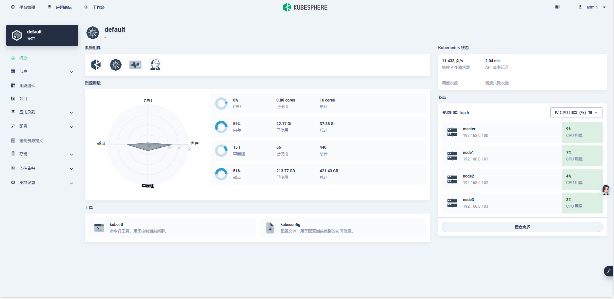
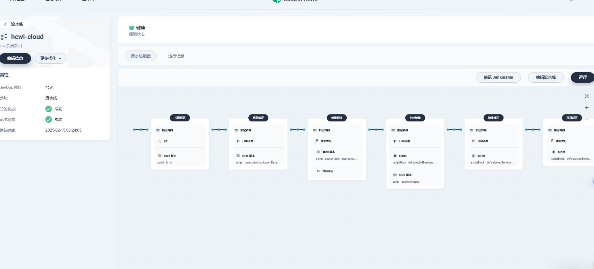
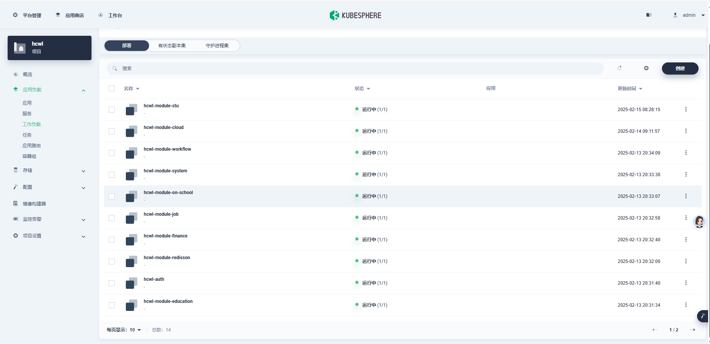
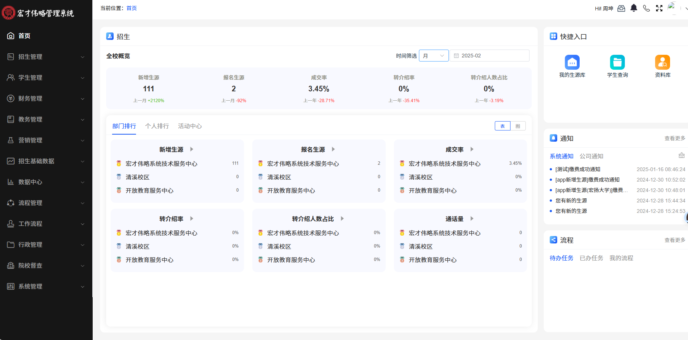
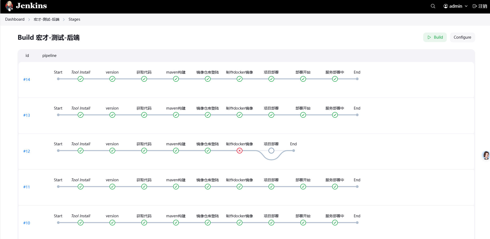

# Kubernetes Deployment Scripts

## 项目简介
本项目用于宏才伟略教育系统的微服务部署，基于Kubernetes（KubeSphere）和Jenkins实现自动化CI/CD流程。

## 技术栈
- Kubernetes v1.28.2
- Jenkins 2.346
- Docker 20.10
- Helm 3.8

## 功能特性
1. **Kubernetes部署**：支持Deployment、Service、Ingress等核心资源配置。
2. **Jenkins Pipeline**：实现自动化构建、测试、部署流程。
3. **健康检查**：通过`livenessProbe`和`readinessProbe`确保服务高可用。
4. **自动扩缩容**：支持HPA根据CPU/内存使用率动态调整Pod数量。

## 快速开始
1. 克隆本仓库：
   ```bash
   git clone https://github.com/86547462/deploy.git  
## 部分项目截图




