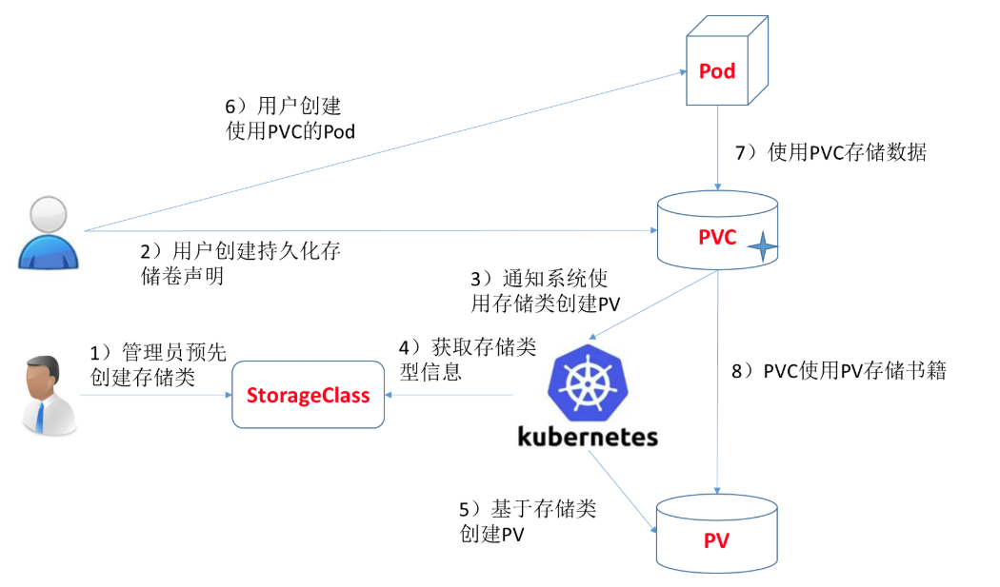

# 01、安装kubernetes集群（单master节点方式）

# 视频地址
[bilibili](https://player.bilibili.com/player.html?bvid=BV1f54y1y7Vn&p=1&page=1)

# 一、环境准备
## 1、系统要求
按量付费阿里云主机三台

要求：**centos7.6~7.8**；以下为 [https://kuboard.cn/install/install-k8s.html#%E6%A3%80%E6%9F%A5-centos-hostname](https://kuboard.cn/install/install-k8s.html#%E6%A3%80%E6%9F%A5-centos-hostname) 网站的检验结果。

| CentOS 版本 | 本文档是否兼容 | 备注 |
| :--- | :--- | :--- |
| 7.8 | 😄 | 已验证 |
| 7.7 | 😄 | 已验证 |
| 7.6 | 😄 | 已验证 |
| 7.5 | 😞 | 已证实会出现 kubelet 无法启动的问题 |
| 7.4 | 😞 | 已证实会出现 kubelet 无法启动的问题 |
| 7.3 | 😞 | 已证实会出现 kubelet 无法启动的问题 |
| 7.2 | 😞 | 已证实会出现 kubelet 无法启动的问题 |


## 2、前置步骤（所有节点）
+ centos 版本为 7.6 或 7.7、CPU 内核数量大于等于 2，且内存大于等于 4G
+ hostname 不是 localhost，且不包含下划线、小数点、大写字母
+ 任意节点都有固定的内网 IP 地址(集群机器统一内网)
+ 任意节点上 IP 地址 可互通（无需 NAT 映射即可相互访问），且没有防火墙、安全组隔离
+ 任意节点不会直接使用 docker run 或 docker-compose 运行容器。Pod

```shell
#关闭防火墙： 或者阿里云开通安全组端口访问
systemctl stop firewalld
systemctl disable firewalld

#关闭 selinux： 
sed -i 's/enforcing/disabled/' /etc/selinux/config
setenforce 0

#关闭 swap：
swapoff -a  #临时 
sed -ri 's/.*swap.*/#&/' /etc/fstab  #永久

#将桥接的 IPv4 流量传递到 iptables 的链：
# 修改 /etc/sysctl.conf
# 如果有配置，则修改
sed -i "s#^net.ipv4.ip_forward.*#net.ipv4.ip_forward=1#g"  /etc/sysctl.conf
sed -i "s#^net.bridge.bridge-nf-call-ip6tables.*#net.bridge.bridge-nf-call-ip6tables=1#g"  /etc/sysctl.conf
sed -i "s#^net.bridge.bridge-nf-call-iptables.*#net.bridge.bridge-nf-call-iptables=1#g"  /etc/sysctl.conf
sed -i "s#^net.ipv6.conf.all.disable_ipv6.*#net.ipv6.conf.all.disable_ipv6=1#g"  /etc/sysctl.conf
sed -i "s#^net.ipv6.conf.default.disable_ipv6.*#net.ipv6.conf.default.disable_ipv6=1#g"  /etc/sysctl.conf
sed -i "s#^net.ipv6.conf.lo.disable_ipv6.*#net.ipv6.conf.lo.disable_ipv6=1#g"  /etc/sysctl.conf
sed -i "s#^net.ipv6.conf.all.forwarding.*#net.ipv6.conf.all.forwarding=1#g"  /etc/sysctl.conf
# 可能没有，追加
echo "net.ipv4.ip_forward = 1" >> /etc/sysctl.conf
echo "net.bridge.bridge-nf-call-ip6tables = 1" >> /etc/sysctl.conf
echo "net.bridge.bridge-nf-call-iptables = 1" >> /etc/sysctl.conf
echo "net.ipv6.conf.all.disable_ipv6 = 1" >> /etc/sysctl.conf
echo "net.ipv6.conf.default.disable_ipv6 = 1" >> /etc/sysctl.conf
echo "net.ipv6.conf.lo.disable_ipv6 = 1" >> /etc/sysctl.conf
echo "net.ipv6.conf.all.forwarding = 1"  >> /etc/sysctl.conf
# 执行命令以应用
sysctl -p
```


# 二、安装Docker环境（所有节点）
```shell
#1、安装docker
##1.1、卸载旧版本
sudo yum remove docker \
	docker-client \
	docker-client-latest \
	docker-common \
	docker-latest \
	docker-latest-logrotate \
	docker-logrotate \
	docker-engine
##1.2、安装基础依赖
yum install -y yum-utils \
device-mapper-persistent-data \
lvm2

##1.3、配置docker yum源
sudo yum-config-manager \
--add-repo \
http://mirrors.aliyun.com/docker-ce/linux/centos/docker-ce.repo

##1.4、安装并启动 docker
yum install -y docker-ce-19.03.8 docker-ce-cli-19.03.8 containerd.io
systemctl enable docker
systemctl start docker

##1.5、配置docker加速
sudo mkdir -p /etc/docker
sudo tee /etc/docker/daemon.json <<-'EOF'
{
  "registry-mirrors": ["https://t1gbabbr.mirror.aliyuncs.com"]
}
EOF
sudo systemctl daemon-reload
sudo systemctl restart docker
```


# 三、安装k8s环境
## 1、安装k8s、kubelet、kubeadm、kubectl（所有节点）
```shell
# 配置K8S的yum源
cat <<EOF > /etc/yum.repos.d/kubernetes.repo
[kubernetes]
name=Kubernetes
baseurl=http://mirrors.aliyun.com/kubernetes/yum/repos/kubernetes-el7-x86_64
enabled=1
gpgcheck=0
repo_gpgcheck=0
gpgkey=http://mirrors.aliyun.com/kubernetes/yum/doc/yum-key.gpg
       http://mirrors.aliyun.com/kubernetes/yum/doc/rpm-package-key.gpg
EOF

# 卸载旧版本
yum remove -y kubelet kubeadm kubectl

# 安装kubelet、kubeadm、kubectl
yum install -y kubelet-1.17.3 kubeadm-1.17.3 kubectl-1.17.3

#开机启动和重启kubelet
systemctl enable kubelet && systemctl start kubelet
##注意，如果此时查看kubelet的状态，他会无限重启，等待接收集群命令，和初始化。这个是正常的。
```

## 2、初始化master节点（master节点）
```shell
#1、下载master节点需要的镜像【选做】
#创建一个.sh文件，内容如下，
#!/bin/bash
images=(
	kube-apiserver:v1.17.3
    kube-proxy:v1.17.3
	kube-controller-manager:v1.17.3
	kube-scheduler:v1.17.3
	coredns:1.6.5
	etcd:3.4.3-0
    pause:3.1
)
for imageName in ${images[@]} ; do
    docker pull registry.cn-hangzhou.aliyuncs.com/google_containers/$imageName
done


#2、初始化master节点
kubeadm init \
--apiserver-advertise-address=172.26.165.243 \
--image-repository registry.cn-hangzhou.aliyuncs.com/google_containers \
--kubernetes-version v1.17.3 \
--service-cidr=10.96.0.0/16 \
--pod-network-cidr=192.168.0.0/16


#service网络和pod网络；docker service create 
#docker container --> ip brigde
#Pod ---> ip 地址，整个集群 Pod 是可以互通。255*255
#service ---> 

#3、配置 kubectl
mkdir -p $HOME/.kube
sudo cp -i /etc/kubernetes/admin.conf $HOME/.kube/config
sudo chown $(id -u):$(id -g) $HOME/.kube/config

#4、提前保存令牌
kubeadm join 172.26.165.243:6443 --token afb6st.b7jz45ze7zpg65ii \
    --discovery-token-ca-cert-hash sha256:e5e5854508dafd04f0e9cf1f502b5165e25ff3017afd23cade0fe6acb5bc14ab

#5、部署网络插件
#上传网络插件，并部署
#kubectl apply -f calico-3.13.1.yaml
kubectl apply -f https://docs.projectcalico.org/manifests/calico.yaml

#网络好的时候，就没有下面的操作了
calico：
image: calico/cni:v3.14.0
image: calico/cni:v3.14.0
image: calico/pod2daemon-flexvol:v3.14.0
image: calico/node:v3.14.0
image: calico/kube-controllers:v3.14.0


#6、查看状态，等待就绪
watch kubectl get pod -n kube-system -o wide
```


## 3、worker加入集群
```shell
#1、使用刚才master打印的令牌命令加入
kubeadm join 172.26.248.150:6443 --token ktnvuj.tgldo613ejg5a3x4 \
    --discovery-token-ca-cert-hash sha256:f66c496cf7eb8aa06e1a7cdb9b6be5b013c613cdcf5d1bbd88a6ea19a2b454ec
#2、如果超过2小时忘记了令牌，可以这样做
kubeadm token create --print-join-command #打印新令牌
kubeadm token create --ttl 0 --print-join-command #创建个永不过期的令牌
```

## 4、搭建NFS作为默认sc
### 4.1、配置NFS服务器
```shell
yum install -y nfs-utils
#执行命令 vi /etc/exports，创建 exports 文件，文件内容如下：
echo "/nfs/data/ *(insecure,rw,sync,no_root_squash)" > /etc/exports
#/nfs/data  172.26.248.0/20(rw,no_root_squash)
#执行以下命令，启动 nfs 服务
# 创建共享目录
mkdir -p /nfs/data
systemctl enable rpcbind
systemctl enable nfs-server
systemctl start rpcbind
systemctl start nfs-server
exportfs -r
#检查配置是否生效
exportfs
# 输出结果如下所示
/nfs/data /nfs/data
```

```yaml
#测试Pod直接挂载NFS了
apiVersion: v1
kind: Pod
metadata:
  name: vol-nfs
  namespace: default
spec:
  volumes:
  - name: html
    nfs:
      path: /nfs/data   #1000G
      server: 自己的nfs服务器地址
  containers:
  - name: myapp
    image: nginx
    volumeMounts:
    - name: html
      mountPath: /usr/share/nginx/html/
```

### 4.2、搭建NFS-Client
```shell
#服务器端防火墙开放111、662、875、892、2049的 tcp / udp 允许，否则远端客户无法连接。
#安装客户端工具
yum install -y nfs-utils


#执行以下命令检查 nfs 服务器端是否有设置共享目录
# showmount -e $(nfs服务器的IP)
showmount -e 172.26.165.243
# 输出结果如下所示
Export list for 172.26.165.243
/nfs/data *

#执行以下命令挂载 nfs 服务器上的共享目录到本机路径 /root/nfsmount
mkdir /root/nfsmount
# mount -t nfs $(nfs服务器的IP):/root/nfs_root /root/nfsmount
#高可用备份的方式
mount -t nfs 172.26.165.243:/nfs/data /root/nfsmount
# 写入一个测试文件
echo "hello nfs server" > /root/nfsmount/test.txt

#在 nfs 服务器上执行以下命令，验证文件写入成功
cat /data/volumes/test.txt
```


### 4.3、设置动态供应



#### 4.3.1、创建provisioner（NFS环境前面已经搭好）
| 字段名称 | 填入内容 | 备注 |
| :--- | :--- | :--- |
| 名称 | nfs-storage | 自定义存储类名称 |
| NFS Server | 172.26.165.243 | NFS服务的IP地址 |
| NFS Path | /nfs/data | NFS服务所共享的路径 |


<font style="color:#333333;"></font>

```yaml
# 先创建授权
# vi nfs-rbac.yaml
---
apiVersion: v1
kind: ServiceAccount
metadata:
  name: nfs-provisioner
---
kind: ClusterRole
apiVersion: rbac.authorization.k8s.io/v1
metadata:
   name: nfs-provisioner-runner
rules:
   -  apiGroups: [""]
      resources: ["persistentvolumes"]
      verbs: ["get", "list", "watch", "create", "delete"]
   -  apiGroups: [""]
      resources: ["persistentvolumeclaims"]
      verbs: ["get", "list", "watch", "update"]
   -  apiGroups: ["storage.k8s.io"]
      resources: ["storageclasses"]
      verbs: ["get", "list", "watch"]
   -  apiGroups: [""]
      resources: ["events"]
      verbs: ["watch", "create", "update", "patch"]
   -  apiGroups: [""]
      resources: ["services", "endpoints"]
      verbs: ["get","create","list", "watch","update"]
   -  apiGroups: ["extensions"]
      resources: ["podsecuritypolicies"]
      resourceNames: ["nfs-provisioner"]
      verbs: ["use"]
---
kind: ClusterRoleBinding
apiVersion: rbac.authorization.k8s.io/v1
metadata:
  name: run-nfs-provisioner
subjects:
  - kind: ServiceAccount
    name: nfs-provisioner
    namespace: default
roleRef:
  kind: ClusterRole
  name: nfs-provisioner-runner
  apiGroup: rbac.authorization.k8s.io
---
#vi nfs-deployment.yaml；创建nfs-client的授权
kind: Deployment
apiVersion: apps/v1
metadata:
   name: nfs-client-provisioner
spec:
   replicas: 1
   strategy:
     type: Recreate
   selector:
     matchLabels:
        app: nfs-client-provisioner
   template:
      metadata:
         labels:
            app: nfs-client-provisioner
      spec:
         serviceAccount: nfs-provisioner
         containers:
            -  name: nfs-client-provisioner
               image: lizhenliang/nfs-client-provisioner
               volumeMounts:
                 -  name: nfs-client-root
                    mountPath:  /persistentvolumes
               env:
                 -  name: PROVISIONER_NAME #供应者的名字
                    value: storage.pri/nfs #名字虽然可以随便起，以后引用要一致
                 -  name: NFS_SERVER
                    value: 172.26.165.243
                 -  name: NFS_PATH
                    value: /nfs/data
         volumes:
           - name: nfs-client-root
             nfs:
               server: 172.26.165.243
               path: /nfs/data
##这个镜像中volume的mountPath默认为/persistentvolumes，不能修改，否则运行时会报错
```

```yaml
#创建storageclass
# vi storageclass-nfs.yaml
apiVersion: storage.k8s.io/v1
kind: StorageClass
metadata:
  name: storage-nfs
provisioner: storage.pri/nfs
reclaimPolicy: Delete

#扩展"reclaim policy"有三种方式：Retain、Recycle、Deleted。
Retain
#保护被PVC释放的PV及其上数据，并将PV状态改成"released"，不将被其它PVC绑定。集群管理员手动通过如下步骤释放存储资源：
手动删除PV，但与其相关的后端存储资源如(AWS EBS, GCE PD, Azure Disk, or Cinder volume)仍然存在。
手动清空后端存储volume上的数据。
手动删除后端存储volume，或者重复使用后端volume，为其创建新的PV。

Delete
删除被PVC释放的PV及其后端存储volume。对于动态PV其"reclaim policy"继承自其"storage class"，
默认是Delete。集群管理员负责将"storage class"的"reclaim policy"设置成用户期望的形式，否则需要用
户手动为创建后的动态PV编辑"reclaim policy"

Recycle
保留PV，但清空其上数据，已废弃

```

#### 4.3.2、创建存储类
```yaml
#创建storageclass
# vi storageclass-nfs.yaml
apiVersion: storage.k8s.io/v1
kind: StorageClass
metadata:
  name: storage-nfs
provisioner: storage.pri/nfs
reclaimPolicy: Delete

```

 "reclaim policy"有三种方式：Retain、Recycle、Deleted。

+ Retain
    - 保护被PVC释放的PV及其上数据，并将PV状态改成"released"，不将被其它PVC绑定。集群管理员手动通过如下步骤释放存储资源
        * 手动删除PV，但与其相关的后端存储资源如(AWS EBS, GCE PD, Azure Disk, or Cinder volume)仍然存在。
        * 手动清空后端存储volume上的数据。
        * 手动删除后端存储volume，或者重复使用后端volume，为其创建新的PV。
+ Delete
    - 删除被PVC释放的PV及其后端存储volume。对于动态PV其"reclaim policy"继承自其"storage class"，
    - 默认是Delete。集群管理员负责将"storage class"的"reclaim policy"设置成用户期望的形式，否则需要用户手动为创建后的动态PV编辑"reclaim policy"
+ Recycle
    - 保留PV，但清空其上数据，已废弃


#### 4.3.3、改变默认sc
```shell
##改变系统默认sc
https://kubernetes.io/zh/docs/tasks/administer-cluster/change-default-storage-class/#%e4%b8%ba%e4%bb%80%e4%b9%88%e8%a6%81%e6%94%b9%e5%8f%98%e9%bb%98%e8%ae%a4-storage-class

kubectl patch storageclass storage-nfs -p '{"metadata": {"annotations":{"storageclass.kubernetes.io/is-default-class":"true"}}}'
```

### 4.4、验证nfs动态供应
#### 4.4.1、创建pvc
```yaml
#vi  pvc.yaml
apiVersion: v1
kind: PersistentVolumeClaim
metadata:
  name: pvc-claim-01
 # annotations:
 #   volume.beta.kubernetes.io/storage-class: "storage-nfs"
spec:
  storageClassName: storage-nfs  #这个class一定注意要和sc的名字一样
  accessModes:
    - ReadWriteMany
  resources:
    requests:
      storage: 1Mi
```


#### 4.4.2、使用pvc
```yaml
#vi testpod.yaml
kind: Pod
apiVersion: v1
metadata:
  name: test-pod
spec:
  containers:
  - name: test-pod
    image: busybox
    command:
      - "/bin/sh"
    args:
      - "-c"
      - "touch /mnt/SUCCESS && exit 0 || exit 1"
    volumeMounts:
      - name: nfs-pvc
        mountPath: "/mnt"
  restartPolicy: "Never"
  volumes:
    - name: nfs-pvc
      persistentVolumeClaim:
        claimName: pvc-claim-01
```

## 5、安装metrics-server
```yaml
#1、先安装metrics-server(yaml如下，已经改好了镜像和配置，可以直接使用)，这样就能监控到pod。node的资源情况（默认只有cpu、memory的资源审计信息哟，更专业的我们后面对接 Prometheus）
---
apiVersion: rbac.authorization.k8s.io/v1
kind: ClusterRole
metadata:
  name: system:aggregated-metrics-reader
  labels:
    rbac.authorization.k8s.io/aggregate-to-view: "true"
    rbac.authorization.k8s.io/aggregate-to-edit: "true"
    rbac.authorization.k8s.io/aggregate-to-admin: "true"
rules:
- apiGroups: ["metrics.k8s.io"]
  resources: ["pods", "nodes"]
  verbs: ["get", "list", "watch"]
---
apiVersion: rbac.authorization.k8s.io/v1
kind: ClusterRoleBinding
metadata:
  name: metrics-server:system:auth-delegator
roleRef:
  apiGroup: rbac.authorization.k8s.io
  kind: ClusterRole
  name: system:auth-delegator
subjects:
- kind: ServiceAccount
  name: metrics-server
  namespace: kube-system
---
apiVersion: rbac.authorization.k8s.io/v1
kind: RoleBinding
metadata:
  name: metrics-server-auth-reader
  namespace: kube-system
roleRef:
  apiGroup: rbac.authorization.k8s.io
  kind: Role
  name: extension-apiserver-authentication-reader
subjects:
- kind: ServiceAccount
  name: metrics-server
  namespace: kube-system
---
apiVersion: apiregistration.k8s.io/v1beta1
kind: APIService
metadata:
  name: v1beta1.metrics.k8s.io
spec:
  service:
    name: metrics-server
    namespace: kube-system
  group: metrics.k8s.io
  version: v1beta1
  insecureSkipTLSVerify: true
  groupPriorityMinimum: 100
  versionPriority: 100
---
apiVersion: v1
kind: ServiceAccount
metadata:
  name: metrics-server
  namespace: kube-system
---
apiVersion: apps/v1
kind: Deployment
metadata:
  name: metrics-server
  namespace: kube-system
  labels:
    k8s-app: metrics-server
spec:
  selector:
    matchLabels:
      k8s-app: metrics-server
  template:
    metadata:
      name: metrics-server
      labels:
        k8s-app: metrics-server
    spec:
      serviceAccountName: metrics-server
      volumes:
      # mount in tmp so we can safely use from-scratch images and/or read-only containers
      - name: tmp-dir
        emptyDir: {}
      containers:
      - name: metrics-server
        image: mirrorgooglecontainers/metrics-server-amd64:v0.3.6
        imagePullPolicy: IfNotPresent
        args:
          - --cert-dir=/tmp
          - --secure-port=4443
          - --kubelet-insecure-tls
          - --kubelet-preferred-address-types=InternalIP,ExternalIP,Hostname
        ports:
        - name: main-port
          containerPort: 4443
          protocol: TCP
        securityContext:
          readOnlyRootFilesystem: true
          runAsNonRoot: true
          runAsUser: 1000
        volumeMounts:
        - name: tmp-dir
          mountPath: /tmp
      nodeSelector:
        kubernetes.io/os: linux
        kubernetes.io/arch: "amd64"
---
apiVersion: v1
kind: Service
metadata:
  name: metrics-server
  namespace: kube-system
  labels:
    kubernetes.io/name: "Metrics-server"
    kubernetes.io/cluster-service: "true"
spec:
  selector:
    k8s-app: metrics-server
  ports:
  - port: 443
    protocol: TCP
    targetPort: main-port
---
apiVersion: rbac.authorization.k8s.io/v1
kind: ClusterRole
metadata:
  name: system:metrics-server
rules:
- apiGroups:
  - ""
  resources:
  - pods
  - nodes
  - nodes/stats
  - namespaces
  - configmaps
  verbs:
  - get
  - list
  - watch
---
apiVersion: rbac.authorization.k8s.io/v1
kind: ClusterRoleBinding
metadata:
  name: system:metrics-server
roleRef:
  apiGroup: rbac.authorization.k8s.io
  kind: ClusterRole
  name: system:metrics-server
subjects:
- kind: ServiceAccount
  name: metrics-server
  namespace: kube-system
```

## 


> 更新: 2024-07-23 10:31:06  
> 原文: <https://www.yuque.com/leifengyang/kubesphere/grw8se>