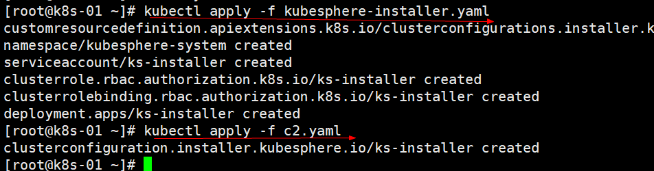
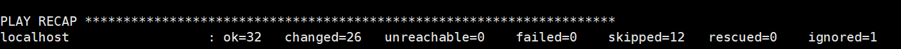

# 02、安装kubesphere v3.0.0

## 视频地址
[bilibili](https://player.bilibili.com/player.html?bvid=BV1f54y1y7Vn&p=6&page=6)


[https://kubesphere.com.cn/](https://kubesphere.com.cn/)


部署文档地址

[https://kubesphere.com.cn/docs/quick-start/minimal-kubesphere-on-k8s/](https://kubesphere.com.cn/docs/quick-start/minimal-kubesphere-on-k8s/)


## 1、修改集群配置
```yaml
vi cluster-configuration.yaml

---
apiVersion: installer.kubesphere.io/v1alpha1
kind: ClusterConfiguration
metadata:
  name: ks-installer
  namespace: kubesphere-system
  labels:
    version: v3.0.0
spec:
  persistence:
    storageClass: ""        # If there is not a default StorageClass in your cluster, you need to specify an existing StorageClass here.
  authentication:
    jwtSecret: ""           # Keep the jwtSecret consistent with the host cluster. Retrive the jwtSecret by executing "kubectl -n kubesphere-system get cm kubesphere-config -o yaml | grep -v "apiVersion" | grep jwtSecret" on the host cluster.
  etcd:
    monitoring: true       # Whether to enable etcd monitoring dashboard installation. You have to create a secret for etcd before you enable it.
    endpointIps: 172.26.165.243  # etcd cluster EndpointIps, it can be a bunch of IPs here.
    port: 2379              # etcd port
    tlsEnable: true
  common:
    mysqlVolumeSize: 20Gi # MySQL PVC size.
    minioVolumeSize: 20Gi # Minio PVC size.
    etcdVolumeSize: 20Gi  # etcd PVC size.
    openldapVolumeSize: 2Gi   # openldap PVC size.
    redisVolumSize: 2Gi # Redis PVC size.
    es:   # Storage backend for logging, events and auditing.
      # elasticsearchMasterReplicas: 1   # total number of master nodes, it's not allowed to use even number
      # elasticsearchDataReplicas: 1     # total number of data nodes.
      elasticsearchMasterVolumeSize: 4Gi   # Volume size of Elasticsearch master nodes.
      elasticsearchDataVolumeSize: 20Gi    # Volume size of Elasticsearch data nodes.
      logMaxAge: 7                     # Log retention time in built-in Elasticsearch, it is 7 days by default.
      elkPrefix: logstash              # The string making up index names. The index name will be formatted as ks-<elk_prefix>-log.
  console:
    enableMultiLogin: true  # enable/disable multiple sing on, it allows an account can be used by different users at the same time.
    port: 30880
  alerting:                # (CPU: 0.3 Core, Memory: 300 MiB) Whether to install KubeSphere alerting system. It enables Users to customize alerting policies to send messages to receivers in time with different time intervals and alerting levels to choose from.
    enabled: true
  auditing:                # Whether to install KubeSphere audit log system. It provides a security-relevant chronological set of records，recording the sequence of activities happened in platform, initiated by different tenants.
    enabled: true
  devops:                  # (CPU: 0.47 Core, Memory: 8.6 G) Whether to install KubeSphere DevOps System. It provides out-of-box CI/CD system based on Jenkins, and automated workflow tools including Source-to-Image & Binary-to-Image.
    enabled: true
    jenkinsMemoryLim: 2Gi      # Jenkins memory limit.
    jenkinsMemoryReq: 1500Mi   # Jenkins memory request.
    jenkinsVolumeSize: 8Gi     # Jenkins volume size.
    jenkinsJavaOpts_Xms: 512m  # The following three fields are JVM parameters.
    jenkinsJavaOpts_Xmx: 512m
    jenkinsJavaOpts_MaxRAM: 2g
  events:                  # Whether to install KubeSphere events system. It provides a graphical web console for Kubernetes Events exporting, filtering and alerting in multi-tenant Kubernetes clusters.
    enabled: true
    ruler:
      enabled: true
      replicas: 2
  logging:                 # (CPU: 57 m, Memory: 2.76 G) Whether to install KubeSphere logging system. Flexible logging functions are provided for log query, collection and management in a unified console. Additional log collectors can be added, such as Elasticsearch, Kafka and Fluentd.
    enabled: true
    logsidecarReplicas: 2
  metrics_server:                    # (CPU: 56 m, Memory: 44.35 MiB) Whether to install metrics-server. IT enables HPA (Horizontal Pod Autoscaler).
    enabled: false
  monitoring:
    # prometheusReplicas: 1            # Prometheus replicas are responsible for monitoring different segments of data source and provide high availability as well.
    prometheusMemoryRequest: 400Mi   # Prometheus request memory.
    prometheusVolumeSize: 20Gi       # Prometheus PVC size.
    # alertmanagerReplicas: 1          # AlertManager Replicas.
  multicluster:
    clusterRole: none  # host | member | none  # You can install a solo cluster, or specify it as the role of host or member cluster.
  networkpolicy:       # Network policies allow network isolation within the same cluster, which means firewalls can be set up between certain instances (Pods).
    # Make sure that the CNI network plugin used by the cluster supports NetworkPolicy. There are a number of CNI network plugins that support NetworkPolicy, including Calico, Cilium, Kube-router, Romana and Weave Net.
    enabled: true
  notification:        # Email Notification support for the legacy alerting system, should be enabled/disabled together with the above alerting option.
    enabled: true
  openpitrix:          # (2 Core, 3.6 G) Whether to install KubeSphere Application Store. It provides an application store for Helm-based applications, and offer application lifecycle management.
    enabled: true
  servicemesh:         # (0.3 Core, 300 MiB) Whether to install KubeSphere Service Mesh (Istio-based). It provides fine-grained traffic management, observability and tracing, and offer visualization for traffic topology.
    enabled: true

```




**修改：cluster-configuration.yaml完成以后重新kubectl apply -f 一下，ks-installer就会自动重新安装kubesphere。一定在安装过程中不要出现failed；**




监控

kubectl logs -n kubesphere-system $(kubectl get pod -n kubesphere-system -l app=ks-install -o jsonpath='{.items[0].metadata.name}') -f


## 2、解决etcd监控证书找不到问题


```shell
kubectl -n kubesphere-monitoring-system create secret generic kube-etcd-client-certs  --from-file=etcd-client-ca.crt=/etc/kubernetes/pki/etcd/ca.crt  --from-file=etcd-client.crt=/etc/kubernetes/pki/apiserver-etcd-client.crt  --from-file=etcd-client.key=/etc/kubernetes/pki/apiserver-etcd-client.key

--etcd-cafile=/etc/kubernetes/pki/etcd/ca.crt 
--etcd-certfile=/etc/kubernetes/pki/apiserver-etcd-client.crt 
--etcd-keyfile=/etc/kubernetes/pki/apiserver-etcd-client.key

ps -ef|grep kube-apiserver

## kube-etcd-client-certs
```


> 更新: 2024-07-23 10:31:23  
> 原文: <https://www.yuque.com/leifengyang/kubesphere/qcvhx3>