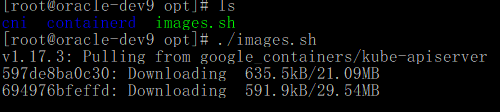

# kubesphere3.0的安装文档

**本文档已经过时：参照 《云原生实战》最新教程**

**新视频地址：**[**https://www.bilibili.com/video/BV13Q4y1C7hS**](https://www.bilibili.com/video/BV13Q4y1C7hS)

**第 68集开始完整讲解KubeSphere使用与安装流程**

基于kubernetes环境安装kubesphere3.0的安装文档

本文档主要是在centos7系统下基于kubernetes环境安装kubesphere3.0的安装文档。

# 1   环境准备
## 1.1 系统要求
本地虚拟机三台

要求：centos7.6~7.8；以下为

[https://kuboard.cn/install/install-k8s.html#%E6%A3%80%E6%9F%A5-centos-hostname](https://kuboard.cn/install/install-k8s.html#%25E6%25A3%2580%25E6%259F%25A5-centos-hostname) 网站的检验结果。

| CentOS 版本 | 本文档是否兼容 | 备注 |
| --- | --- | --- |
| 7.8 | 是 | 已经验证 |
| 7.7 | 是 | 已经验证 |
| 7.6 | 是 | 已经验证 |
| 7.5 | 否 | 已证实会出现 kubelet 无法启动的问题 |
| 7.4 | 否 | 已证实会出现 kubelet 无法启动的问题 |
| 7.3 | 否 | 已证实会出现 kubelet 无法启动的问题 |
| 7.2 | 否 | 已证实会出现 kubelet 无法启动的问题 |

## 1.2 虚拟机安装步骤
安装虚拟机比较的简单，这里不做介绍。

### 1.2.1 创建客户机的向导
#### 1.2.1.1   创建新的虚拟机

点击创建新的虚拟机。

#### 1.2.1.2   新建虚拟机向导

选择典型，点击下一步。

#### 1.2.1.3   安装客户机的操作系统

选择稍后安装操作系统，点击下一步。

#### 1.2.1.4   选择客户机的操作系统类型

我们这里安装的Linux Centos7版本。这里我们选择的Linux系统。版本选择Redhat Enterpise Linux7 64位。

#### 1.2.1.5   命名客户机和存储位置

这里根据自己的情况设置客户机的名称以及客户存储的本地的位置。

#### 1.2.1.6   配置客户机的磁盘的大小

默认给出的20G，这里我设置的大一写。设置成100G。点击下一步。

#### 1.2.1.7   已经准备创建好的客户机

点击完成。基本的客户机的创建向导完成。

#### 1.2.1.8   配置客户机的属性
##### 1.2.1.8.1     内存配置大小

这里我们一般设置成企业：8G、个人使用2G做演示。

##### 1.2.1.8.2     处理器配置

处理器配置，我们一般配置成2个处理器。

##### 1.2.1.8.3     硬盘配置

这里默认选择。不需要操作。

##### 1.2.1.8.4     CD/DVD配置

设备状态设置成启动时连接，选择ISO镜像文件连接并配置好连接。

##### 1.2.1.8.5     网络适配器配置

在本地配置下我们使用的NAT模式。如果在企业搭建上，建议使用桥接模式。

##### 1.2.1.8.6     USB控制器配置

对服务器来说，不需要该设备。移除即可。

##### 1.2.1.8.7     声卡配置

对服务器来说，不需要该设备。移除即可。

##### 1.2.1.8.8     打印机配置

对服务器来说，不需要该设备。移除即可。

##### 1.2.1.8.9     显示器配置

不需要操作，使用默认即可。

这里客户机的基本的配置基本完成。

#### 1.2.1.9   安装客户机的步骤
##### 1.2.1.9.1     开始安装客户机系统

##### 1.2.1.9.2     按下回车开始安装配置虚拟机安装属性

等待加载系统镜像完毕。

##### 1.2.1.9.3     选择客户机的系统语言

这里我们选择中文简体。点击继续。

##### 1.2.1.9.4     设置安装客户机的基本配置
###### 1.2.1.9.4.1    安装选择类型

点击完成。

##### 1.2.1.9.5     开始安装客户机系统

点击开始安装。

##### 1.2.1.9.6     用户设置

创建密码。自己记住即可。这里是管理员登录密码。

##### 1.2.1.9.7     安装系统进行中

此处需要等待一段时间，不同的机器配置等待的时间不一致。

##### 1.2.1.9.8     初始化客户机的步骤
安装成功之后，我们看到以下的图。

点击重启即可。

##### 1.2.1.9.9     接受许可证

勾选我同意许可协议。重启系统。输入用户名密码登录到系统。至此我们的系统客户机安装成功。

##### 1.2.1.9.10   系统欢迎页面

选择汉语，点击前进。

##### 1.2.1.9.11   自定义键盘输入法

选择汉语，点击前进。

##### 1.2.1.9.12   隐私设置

点击前进。

##### 1.2.1.9.13   在线登录账号

这里我们跳过即可。

##### 1.2.1.9.14   开始使用系统

##### 1.2.1.9.15   打开终端输入命令行查询IP地址

我们连接的ens33的网卡，因此我们得到的本地的IP地址为：192.168.196.128，这里每个人的IP地址不一样。根据自己的实际情况获取IP地址。

###### 1.2.1.9.15.1   注意，如果没有ip显示：
你可以在/etc/sysconfig/network-scripts  这个目录下面的ifcfg-ens33这个文件里面的**O****NBOOT=no****，修改成****ONBOOT=yes****，然后通过命于重新启动网络服务。**

**重新启动网络服务：**

/etc/init.d/network restart 或 service network restart

然后可设置静态网络ip：

设置静态ip的话，一定要记住，设置GATEWAY网关的时候要跟虚拟网络编辑器的网关要一致，否则无法上网！！！

 

**设置完静态****IP****以后重新启动网络服务：**

/etc/init.d/network restart 或 service network restart

 

然后测试能不能上网:

ping www.baidu.com

##### 1.2.1.9.16   使用外部客户端工具连接

这里虚拟机安装centos7系统完成。

安装安装上述的安装方式，需要安装三台虚拟机。

## 1.3 虚拟机环境如下
| IP地址 | 说明 | 说明 |
| --- | --- | --- |
| 192.168.142.144 | master节点 | 8G内存 4核CPU |
| 192.168.142.145 | node1节点 | 8G内存 4核CPU |
| 192.168.142.146 | node2节点 | 8G内存 4核CPU |

## 1.4 前置步骤说明
1)   centos 版本为 7.6 或 7.7、CPU 内核数量大于等于 2，且内存大于等于 4G。

2)   hostname 不是 localhost，且不包含下划线、小数点、大写字母。

3)   任意节点都有固定的内网 IP 地址(集群机器统一内网)。

4)   任意节点上 IP 地址 可互通（无需 NAT 映射即可相互访问），且没有防火墙、安全组隔离。

5)   任意节点不会直接使用 docker run 或 docker-compose 运行容器，Pod。

### 1.4.1 安装基础工具
| yum install -y wget && yum install -y vim && yum install -y lsof && yum install -y net-tools |
| --- |

### 1.4.2 配置hosts的地址名称
| vim /etc/hosts   192.168.142.147 k8s-node1 192.168.142.148 k8s-node2 192.168.142.149 k8s-node3 hostnamectl set-hostname <newhostname>：指定新的hostname su 切换过来   |
| --- |

 

### 1.4.3 关闭防火墙或者阿里云开通安全组端口访问
| systemctl stop firewalld systemctl disable firewalld   执行关闭命令： systemctl stop firewalld.service 再次执行查看防火墙命令：systemctl status firewalld.service 执行开机禁用防火墙自启命令  ： systemctl disable firewalld.service   |
| --- |

### 1.4.4 关闭 selinux
| sed -i 's/enforcing/disabled/' /etc/selinux/config setenforce 0 cat /etc/selinux/config |
| --- |

### 1.4.5 关闭 swap
| swapoff -a  #临时 sed -ri 's/.*swap.*/#&/' /etc/fstab  #永久 free -l -h |
| --- |

 

### 1.4.6 将桥接的 IPv4 流量传递到 iptables 的链
#### 1.4.6.1   如果没有/etc/sysctl.conf文件的话直接执行
| echo "net.ipv4.ip_forward = 1" >> /etc/sysctl.conf echo "net.bridge.bridge-nf-call-ip6tables = 1" >> /etc/sysctl.conf echo "net.bridge.bridge-nf-call-iptables = 1" >> /etc/sysctl.conf echo "net.ipv6.conf.all.disable_ipv6 = 1" >> /etc/sysctl.conf echo "net.ipv6.conf.default.disable_ipv6 = 1" >> /etc/sysctl.conf echo "net.ipv6.conf.lo.disable_ipv6 = 1" >> /etc/sysctl.conf echo "net.ipv6.conf.all.forwarding = 1"  >> /etc/sysctl.conf |
| --- |

#### 1.4.6.2   如果有该文件可以执行以下命令
| sed -i "s#^net.ipv4.ip_forward.*#net.ipv4.ip_forward=1#g"  /etc/sysctl.conf sed -i "s#^net.bridge.bridge-nf-call-ip6tables.*#net.bridge.bridge-nf-call-ip6tables=1#g"  /etc/sysctl.conf sed -i "s#^net.bridge.bridge-nf-call-iptables.*#net.bridge.bridge-nf-call-iptables=1#g"  /etc/sysctl.conf sed -i "s#^net.ipv6.conf.all.disable_ipv6.*#net.ipv6.conf.all.disable_ipv6=1#g"  /etc/sysctl.conf sed -i "s#^net.ipv6.conf.default.disable_ipv6.*#net.ipv6.conf.default.disable_ipv6=1#g"  /etc/sysctl.conf sed -i "s#^net.ipv6.conf.lo.disable_ipv6.*#net.ipv6.conf.lo.disable_ipv6=1#g"  /etc/sysctl.conf sed -i "s#^net.ipv6.conf.all.forwarding.*#net.ipv6.conf.all.forwarding=1#g"  /etc/sysctl.conf |
| --- |

#### 1.4.6.3   执行命令以应用
| sysctl -p |
| --- |

### 1.4.7 安装Docker环境（所有节点）
#### 1.4.7.1   卸载旧版本的docker
| sudo yum remove docker \   docker-client \   docker-client-latest \   docker-common \   docker-latest \   docker-latest-logrotate \   docker-logrotate \   docker-engine |
| --- |

#### 1.4.7.2   安装基础依赖
| yum install -y yum-utils \ device-mapper-persistent-data \ lvm2 |
| --- |

#### 1.4.7.3   配置docker yum源
| sudo yum-config-manager \ --add-repo \ [http://mirrors.aliyun.com/docker-ce/linux/centos/docker-ce.repo](http://mirrors.aliyun.com/docker-ce/linux/centos/docker-ce.repo) |
| --- |

#### 1.4.7.4   安装并启动 docker
| yum install -y docker-ce-19.03.8 docker-ce-cli-19.03.8 containerd.io systemctl enable docker systemctl start docker docker version |
| --- |

#### 1.4.7.5   配置docker加速
##### 1.4.7.5.1     创建docker加速文件夹
| sudo mkdir -p /etc/docker |
| --- |

##### 1.4.7.5.2     登录阿里云获取镜像

如果没有的话，需要手动输入“容器镜像服务”。

| sudo tee /etc/docker/daemon.json <<-'EOF' {   "registry-mirrors": ["https://11l3ppzn.mirror.aliyuncs.com"] } EOF |
| --- |

| systemctl daemon-reload systemctl restart docker |
| --- |

### 1.4.8 安装k8s环境
#### 1.4.8.1   安装k8s、kubelet、kubeadm、kubectl（所有节点）
##### 1.4.8.1.1     配置K8S的yum源
| cat <<EOF > /etc/yum.repos.d/kubernetes.repo [kubernetes] name=Kubernetes baseurl=http://mirrors.aliyun.com/kubernetes/yum/repos/kubernetes-el7-x86_64 enabled=1 gpgcheck=0 repo_gpgcheck=0 gpgkey=http://mirrors.aliyun.com/kubernetes/yum/doc/yum-key.gpg        [http://mirrors.aliyun.com/kubernetes/yum/doc/rpm-package-key.gpg](http://mirrors.aliyun.com/kubernetes/yum/doc/rpm-package-key.gpg) EOF |
| --- |

##### 1.4.8.1.2     卸载旧版本
| yum remove -y kubelet kubeadm kubectl |
| --- |
|   |

##### 1.4.8.1.3     安装kubelet、kubeadm、kubectl
| yum install -y kubelet-1.17.3 kubeadm-1.17.3 kubectl-1.17.3 |
| --- |

必须等待三台主机安装成功。

##### 1.4.8.1.4     开机启动和重启kubelet
| systemctl enable kubelet && systemctl start kubelet |
| --- |

注意，如果此时查看kubelet的状态，他会无限重启，等待接收集群命令，和初始化。这个是正常的。

#### 1.4.8.2   初始化所有节点
##### 1.4.8.2.1     创建一个shell脚本内容如下
新建一个shell脚本名称为image.sh

| vi images.sh   #!/bin/bash images=(   kube-apiserver:v1.17.3     kube-proxy:v1.17.3   kube-controller-manager:v1.17.3   kube-scheduler:v1.17.3   coredns:1.6.5   etcd:3.4.3-0     pause:3.1 ) for imageName in ${images[@]} ; do     docker pull registry.cn-hangzhou.aliyuncs.com/google_containers/$imageName done |
| --- |

##### 1.4.8.2.2     将该脚本授予可执行的权限
| chmod -R 700 images.sh |
| --- |

##### 1.4.8.2.3     执行该脚本命令
| ./images.sh               比较慢，耐心等待 |
| --- |

##### 1.4.8.2.4     初始化master节点
注意，该操作只是在master节点之后构建环境。

| kubeadm init \ --apiserver-advertise-address=192.168.142.144 \ --image-repository registry.cn-hangzhou.aliyuncs.com/google_containers \ --kubernetes-version v1.17.3 \ --service-cidr=10.96.0.0/16 \ --pod-network-cidr=10.244.0.0/16 |
| --- |

--apiserver-advertise-address=10.12.0.9

这里的地址需要修改成master对应的IP地址。

 

###### 1.4.8.2.4.1    如果输入以上内容报错：

    [ERROR FileContent--proc-sys-net-bridge-bridge-nf-call-iptables]: /proc/sys/net/bridge/bridge-nf-call-iptables contents are not set to 1

[preflight] If you know what you are doing, you can make a check non-fatal with `--ignore-preflight-errors=...`

To see the stack trace of this error execute with --v=5 or higher

 

解决方案：

echo "1" >/proc/sys/net/bridge/bridge-nf-call-iptables

 

 

初始化完成。

##### 1.4.8.2.5     配置 kubectl
这里注意的是，一定成初始化成功后面获取复制。

 

 

| mkdir -p $HOME/.kube sudo cp -i /etc/kubernetes/admin.conf $HOME/.kube/config sudo chown $(id -u):$(id -g) $HOME/.kube/config |
| --- |

##### 1.4.8.2.6     部署网络插件
| kubectl apply -f [https://docs.projectcalico.org/manifests/calico.yaml](https://docs.projectcalico.org/manifests/calico.yaml) |
| --- |

##### 1.4.8.2.7     查看节点运行的情况
| kubectl get nodes |
| --- |

##### 1.4.8.2.8     查看所有的pod的运行的情况
| kubectl get pods -A  |
| --- |

这里需要注意的是，必须等所有的状态为Runing才能进行下一步操作。

 

###### 1.4.8.2.8.1    如果上面操作导致pod有报错：
比如爆

error: the server doesn't have a resource type "calico-kube-controllers-544658cf79-bv5mj"

这个异常

 

解决： 可以试下重启一下kubelet服务，然后等待一下，应该就可以了

systemctl restart kubelet 

##### 1.4.8.2.9     执行令牌（在从节点操作）
这里注意的是，一定成初始化成功后面获取复制。

| kubeadm join 192.168.142.138:6443 --token 8yvi2m.466nhemzvyqcxkny     --discovery-token-ca-cert-hash sha256:99a5fdcb4af4dd9c2ee40e48ba420d7630676a77a3c0f2445c260921fdcaf83a     如果在两个从节点运行执行令牌报错：    [ERROR FileContent--proc-sys-net-bridge-bridge-nf-call-iptables]: /proc/sys/net/bridge/bridge-nf-call-iptables contents are not set to 1 [preflight] If you know what you are doing, you can make a check non-fatal with `--ignore-preflight-errors=...` To see the stack trace of this error execute with --v=5 or higher   解决方案，两个从节点都执行以下命令： echo "1" >/proc/sys/net/bridge/bridge-nf-call-iptables |
| --- |
|   #1、如果超过2小时忘记了令牌，可以这样做kubeadm token create --print-join-command #打印新令牌 kubeadm token create --ttl 0 --print-join-command #创建个永不过期的令牌   |

加入令牌完成。

##### 1.4.8.2.10   在主节点查看节点运行的情况
| kubectl get nodes |
| --- |

##### 1.4.8.2.11   查看所有的pod的运行的情况
| kubectl get pods -A |
| --- |

这里需要注意的是，必须等所有的状态为Runing才能进行下一步操作。

### 1.4.9 搭建NFS作为默认sc（所有节点）
#### 1.4.9.1   配置NFS服务器
| yum install -y nfs-utils   echo "/nfs/data/ *(insecure,rw,sync,no_root_squash)" > /etc/exports |
| --- |

#### 1.4.9.2   创建nfs服务器目录（主节点作为服务器，主节点操作）
| mkdir -p /nfs/data |
| --- |

#### 1.4.9.3   启动nfs服务命令
| systemctl enable rpcbind systemctl enable nfs-server systemctl start rpcbind systemctl start nfs-server exportfs -r |
| --- |

#### 1.4.9.4   检查配置是否生效
| exportfs |
| --- |

#### 1.4.9.5   测试Pod直接挂载NFS了（主节点操作）
##### 1.4.9.5.1     在opt目录下创建一个nginx.yaml的文件
| vim nginx.yaml |
| --- |

##### 1.4.9.5.2     写入以下的命令
| apiVersion: v1 kind: Pod metadata:   name: vol-nfs   namespace: default spec:   volumes:   - name: html     nfs:       path: /nfs/data   #1000G       server: 192.168.142.144 #自己的nfs服务器地址   containers:   - name: myapp     image: nginx     volumeMounts:     - name: html       mountPath: /usr/share/nginx/html/ |
| --- |

这里注意：server: 10.12.0.9 #自己的nfs服务器地址

##### 1.4.9.5.3     应用该yaml的pod服务
| kubectl apply -f nginx.yaml |
| --- |

##### 1.4.9.5.4     检查该pod是否允许状态
| kubectl get pod |
| --- |

kubectl get pods -A

这里需要注意的是，必须等所有的状态为Runing才能进行下一步操作。

##### 1.4.9.5.5     查看nginx的pod的IP访问地址
| kubectl get pod -o wide |
| --- |

访问地址: 10.244.107.193

##### 1.4.9.5.6     本地测试访问pod信息
| curl 10.244.107.193 |
| --- |

这里我们看到的是访问的页面是403，我们可以访问具体页面

我们需要在/nfs/data/下新建一个index.html文件。

| cd /nfs/data/ vim index.html |
| --- |

##### 1.4.9.5.7     再次测试访问pod信息
| curl 10.244.107.193 |
| --- |

### 1.4.10   搭建NFS-Client
服务器端防火墙开放111、662、875、892、2049的 tcp / udp 允许，否则远端客户无法连接。

#### 1.4.10.1  安装客户端工具（node节点操作）
| showmount -e 192.168.142.144 |
| --- |

该IP地址是master的IP地址。

#### 1.4.10.2  创建同步文件夹
| mkdir /root/nfsmount ls /root |
| --- |

#### 1.4.10.3  将客户端的/root/nfsmount和/nfs/data/做同步（node节点操作）
| mount -t nfs 192.168.142.144:/nfs/data/ /root/nfsmount |
| --- |

10.12.0.9：是nfs的服务器的地址，这里是master的IP地址。

#### 1.4.10.4  查看原来的文件信息（从）机器
| cat index.html |
| --- |

#### 1.4.10.5  修改原来的文件信息（主）机器
| cat index.html |
| --- |

#### 1.4.10.6  在另外的机器上查看效果
| cat index.html |
| --- |

### 1.4.11   设置动态供应

#### 1.4.11.1  创建provisioner（NFS环境前面已经搭好）
| 字段名称 | 填入内容 | 备注 |
| --- | --- | --- |
| 名称 | nfs-storage | 自定义存储类名称 |
| NFS Server | 192.168.142.147 | NFS服务的IP地址 |
| NFS Path | /nfs/data | NFS服务所共享的路径 |

##### 1.4.11.1.1   先创建授权（master节点操作）
| vim nfs-rbac.yaml  在opt目录下 |
| --- |

新建内容如下：

| --- apiVersion: v1 kind: ServiceAccount metadata:   name: nfs-provisioner --- kind: ClusterRole apiVersion: rbac.authorization.k8s.io/v1 metadata:    name: nfs-provisioner-runner rules:    -  apiGroups: [""]       resources: ["persistentvolumes"]       verbs: ["get", "list", "watch", "create", "delete"]    -  apiGroups: [""]       resources: ["persistentvolumeclaims"]       verbs: ["get", "list", "watch", "update"]    -  apiGroups: ["storage.k8s.io"]       resources: ["storageclasses"]       verbs: ["get", "list", "watch"]    -  apiGroups: [""]       resources: ["events"]       verbs: ["watch", "create", "update", "patch"]    -  apiGroups: [""]       resources: ["services", "endpoints"]       verbs: ["get","create","list", "watch","update"]    -  apiGroups: ["extensions"]       resources: ["podsecuritypolicies"]       resourceNames: ["nfs-provisioner"]       verbs: ["use"] --- kind: ClusterRoleBinding apiVersion: rbac.authorization.k8s.io/v1 metadata:   name: run-nfs-provisioner subjects:   - kind: ServiceAccount     name: nfs-provisioner     namespace: default roleRef:   kind: ClusterRole   name: nfs-provisioner-runner   apiGroup: rbac.authorization.k8s.io --- kind: Deployment apiVersion: apps/v1 metadata:    name: nfs-client-provisioner spec:    replicas: 1    strategy:      type: Recreate    selector:      matchLabels:         app: nfs-client-provisioner    template:       metadata:          labels:             app: nfs-client-provisioner       spec:          serviceAccount: nfs-provisioner          containers:             -  name: nfs-client-provisioner                image: lizhenliang/nfs-client-provisioner                volumeMounts:                  -  name: nfs-client-root                     mountPath:  /persistentvolumes                env:                  -  name: PROVISIONER_NAME                     value: storage.pri/nfs                  -  name: NFS_SERVER                     value: 192.168.142.144                  -  name: NFS_PATH                     value: /nfs/data          volumes:            - name: nfs-client-root              nfs:                server: 192.168.142.144                path: /nfs/data |
| --- |

这个镜像中volume的mountPath默认为/persistentvolumes，不能修改，否则运行时会报错。红色的必须是自己的master的IP地址。

##### 1.4.11.1.2   执行创建nfs的yaml文件信息
| kubectl apply -f nfs-rbac.yaml |
| --- |

 

##### 1.4.11.1.3   如果发现pod有问题，想删除pod进行重新kubectl apply-f nfs-rbac.yaml的话，可以参照这个博客文档：
[https://blog.csdn.net/qq_43542988/article/details/101277263?utm_medium=distribute.pc_relevant_t0.none-task-blog-BlogCommendFromMachineLearnPai2-1.channel_param&depth_1-utm_source=distribute.pc_relevant_t0.none-task-blog-BlogCommendFromMachineLearnPai2-1.channel_param](https://blog.csdn.net/qq_43542988/article/details/101277263?utm_medium=distribute.pc_relevant_t0.none-task-blog-BlogCommendFromMachineLearnPai2-1.channel_param&depth_1-utm_source=distribute.pc_relevant_t0.none-task-blog-BlogCommendFromMachineLearnPai2-1.channel_param)

##### 1.4.11.1.4   查看pod的状态信息
| kubectl get pods -A   如果报错：查看报错信息，这个命令： kubectl describe pod xxx -n kube-system |
| --- |

##### 1.4.11.1.5   创建storageclass（master节点操作）
| vim storageclass-nfs.yaml   apiVersion: storage.k8s.io/v1 kind: StorageClass metadata:   name: storage-nfs provisioner: storage.pri/nfs reclaimPolicy: Delete |
| --- |

##### 1.4.11.1.6   应用storageclass-nfs.yaml文件
| kubectl apply -f storageclass-nfs.yaml |
| --- |

##### 1.4.11.1.7   修改默认的驱动
| kubectl patch storageclass storage-nfs -p '{"metadata": {"annotations":{"storageclass.kubernetes.io/is-default-class":"true"}}}' |
| --- |

| kubectl get sc |
| --- |

### 1.4.12   安装metrics-server
#### 1.4.12.1  准备metrics-server.yaml文件（主节点操作）
| vim metrics-server.yaml |
| --- |

#### 1.4.12.2  编写以下的内容

| --- apiVersion: rbac.authorization.k8s.io/v1 kind: ClusterRole metadata:   name: system:aggregated-metrics-reader   labels:     rbac.authorization.k8s.io/aggregate-to-view: "true"     rbac.authorization.k8s.io/aggregate-to-edit: "true"     rbac.authorization.k8s.io/aggregate-to-admin: "true" rules: - apiGroups: ["metrics.k8s.io"]   resources: ["pods", "nodes"]   verbs: ["get", "list", "watch"] --- apiVersion: rbac.authorization.k8s.io/v1 kind: ClusterRoleBinding metadata:   name: metrics-server:system:auth-delegator roleRef:   apiGroup: rbac.authorization.k8s.io   kind: ClusterRole   name: system:auth-delegator subjects: - kind: ServiceAccount   name: metrics-server   namespace: kube-system --- apiVersion: rbac.authorization.k8s.io/v1 kind: RoleBinding metadata:   name: metrics-server-auth-reader   namespace: kube-system roleRef:   apiGroup: rbac.authorization.k8s.io   kind: Role   name: extension-apiserver-authentication-reader subjects: - kind: ServiceAccount   name: metrics-server   namespace: kube-system --- apiVersion: apiregistration.k8s.io/v1beta1 kind: APIService metadata:   name: v1beta1.metrics.k8s.io spec:   service:     name: metrics-server     namespace: kube-system   group: metrics.k8s.io   version: v1beta1   insecureSkipTLSVerify: true   groupPriorityMinimum: 100   versionPriority: 100 --- apiVersion: v1 kind: ServiceAccount metadata:   name: metrics-server   namespace: kube-system --- apiVersion: apps/v1 kind: Deployment metadata:   name: metrics-server   namespace: kube-system   labels:     k8s-app: metrics-server spec:   selector:     matchLabels:       k8s-app: metrics-server   template:     metadata:       name: metrics-server       labels:         k8s-app: metrics-server     spec:       serviceAccountName: metrics-server       volumes:       # mount in tmp so we can safely use from-scratch images and/or read-only containers       - name: tmp-dir         emptyDir: {}       containers:       - name: metrics-server         image: mirrorgooglecontainers/metrics-server-amd64:v0.3.6         imagePullPolicy: IfNotPresent         args:           - --cert-dir=/tmp           - --secure-port=4443           - --kubelet-insecure-tls           - --kubelet-preferred-address-types=InternalIP,ExternalIP,Hostname         ports:         - name: main-port           containerPort: 4443           protocol: TCP         securityContext:           readOnlyRootFilesystem: true           runAsNonRoot: true           runAsUser: 1000         volumeMounts:         - name: tmp-dir           mountPath: /tmp       nodeSelector:         kubernetes.io/os: linux         kubernetes.io/arch: "amd64" --- apiVersion: v1 kind: Service metadata:   name: metrics-server   namespace: kube-system   labels:     kubernetes.io/name: "Metrics-server"     kubernetes.io/cluster-service: "true" spec:   selector:     k8s-app: metrics-server   ports:   - port: 443     protocol: TCP     targetPort: main-port --- apiVersion: rbac.authorization.k8s.io/v1 kind: ClusterRole metadata:   name: system:metrics-server rules: - apiGroups:   - ""   resources:   - pods   - nodes   - nodes/stats   - namespaces   - configmaps   verbs:   - get   - list   - watch --- apiVersion: rbac.authorization.k8s.io/v1 kind: ClusterRoleBinding metadata:   name: system:metrics-server roleRef:   apiGroup: rbac.authorization.k8s.io   kind: ClusterRole   name: system:metrics-server subjects: - kind: ServiceAccount   name: metrics-server   namespace: kube-system |
| --- |

#### 1.4.12.3  应用该文件pod
| kubectl apply -f metrics-server.yaml |
| --- |

#### 1.4.12.4  查看部署的应用信息状态
| kubectl get pod -A |
| --- |

#### 1.4.12.5  查看系统的监控状态
| kubectl top nodes   如果运行kubectl top nodes这个命令，爆metrics not available yet 这个命令还没有用，那就稍等一会，就能用了 |
| --- |

这里，kubesphere3.0的前置环境全部结束。

## 1.5 安装kubesphere v3.0.0
### 1.5.1 文档地址
[https://kubesphere.com.cn/](https://kubesphere.com.cn/)

### 1.5.2 部署文档地址
[https://kubesphere.com.cn/docs/quick-start/minimal-kubesphere-on-k8s/](https://kubesphere.com.cn/docs/quick-start/minimal-kubesphere-on-k8s/)

### 1.5.3 安装步骤说明（master节点）
#### 1.5.3.1   安装集群配置文件
##### 1.5.3.1.1     准备配置文件cluster-configuration.yaml
| vim cluster-configuration.yaml |
| --- |

##### 1.5.3.1.2     编写以下的内容配置

| --- apiVersion: installer.kubesphere.io/v1alpha1 kind: ClusterConfiguration metadata:   name: ks-installer   namespace: kubesphere-system   labels:     version: v3.0.0 spec:   persistence:     storageClass: ""        # If there is not a default StorageClass in your cluster, you need to specify an existing StorageClass here.   authentication:     jwtSecret: ""           # Keep the jwtSecret consistent with the host cluster. Retrive the jwtSecret by executing "kubectl -n kubesphere-system get cm kubesphere-config -o yaml | grep -v "apiVersion" | grep jwtSecret" on the host cluster.   etcd:     monitoring: true       # Whether to enable etcd monitoring dashboard installation. You have to create a secret for etcd before you enable it.     endpointIps: 10.12.0.9  # etcd cluster EndpointIps, it can be a bunch of IPs here.     port: 2379              # etcd port     tlsEnable: true   common:     mysqlVolumeSize: 20Gi # MySQL PVC size.     minioVolumeSize: 20Gi # Minio PVC size.     etcdVolumeSize: 20Gi  # etcd PVC size.     openldapVolumeSize: 2Gi   # openldap PVC size.     redisVolumSize: 2Gi # Redis PVC size.     es:   # Storage backend for logging, events and auditing.       # elasticsearchMasterReplicas: 1   # total number of master nodes, it's not allowed to use even number       # elasticsearchDataReplicas: 1     # total number of data nodes.       elasticsearchMasterVolumeSize: 4Gi   # Volume size of Elasticsearch master nodes.       elasticsearchDataVolumeSize: 20Gi    # Volume size of Elasticsearch data nodes.       logMaxAge: 7                     # Log retention time in built-in Elasticsearch, it is 7 days by default.       elkPrefix: logstash              # The string making up index names. The index name will be formatted as ks-<elk_prefix>-log.   console:     enableMultiLogin: true  # enable/disable multiple sing on, it allows an account can be used by different users at the same time.     port: 30880   alerting:                # (CPU: 0.3 Core, Memory: 300 MiB) Whether to install KubeSphere alerting system. It enables Users to customize alerting policies to send messages to receivers in time with different time intervals and alerting levels to choose from.     enabled: true   auditing:                # Whether to install KubeSphere audit log system. It provides a security-relevant chronological set of records，recording the sequence of activities happened in platform, initiated by different tenants.     enabled: true   devops:                  # (CPU: 0.47 Core, Memory: 8.6 G) Whether to install KubeSphere DevOps System. It provides out-of-box CI/CD system based on Jenkins, and automated workflow tools including Source-to-Image & Binary-to-Image.     enabled: true     jenkinsMemoryLim: 2Gi      # Jenkins memory limit.     jenkinsMemoryReq: 1500Mi   # Jenkins memory request.     jenkinsVolumeSize: 8Gi     # Jenkins volume size.     jenkinsJavaOpts_Xms: 512m  # The following three fields are JVM parameters.     jenkinsJavaOpts_Xmx: 512m     jenkinsJavaOpts_MaxRAM: 2g   events:                  # Whether to install KubeSphere events system. It provides a graphical web console for Kubernetes Events exporting, filtering and alerting in multi-tenant Kubernetes clusters.     enabled: true     ruler:       enabled: true       replicas: 2   logging:                 # (CPU: 57 m, Memory: 2.76 G) Whether to install KubeSphere logging system. Flexible logging functions are provided for log query, collection and management in a unified console. Additional log collectors can be added, such as Elasticsearch, Kafka and Fluentd.     enabled: true     logsidecarReplicas: 2   metrics_server:                    # (CPU: 56 m, Memory: 44.35 MiB) Whether to install metrics-server. IT enables HPA (Horizontal Pod Autoscaler).     enabled: false   monitoring:     # prometheusReplicas: 1            # Prometheus replicas are responsible for monitoring different segments of data source and provide high availability as well.     prometheusMemoryRequest: 400Mi   # Prometheus request memory.     prometheusVolumeSize: 20Gi       # Prometheus PVC size.     # alertmanagerReplicas: 1          # AlertManager Replicas.   multicluster:     clusterRole: none  # host | member | none  # You can install a solo cluster, or specify it as the role of host or member cluster.   networkpolicy:       # Network policies allow network isolation within the same cluster, which means firewalls can be set up between certain instances (Pods).     # Make sure that the CNI network plugin used by the cluster supports NetworkPolicy. There are a number of CNI network plugins that support NetworkPolicy, including Calico, Cilium, Kube-router, Romana and Weave Net.     enabled: true   notification:        # Email Notification support for the legacy alerting system, should be enabled/disabled together with the above alerting option.     enabled: true   openpitrix:          # (2 Core, 3.6 G) Whether to install KubeSphere Application Store. It provides an application store for Helm-based applications, and offer application lifecycle management.     enabled: true   servicemesh:         # (0.3 Core, 300 MiB) Whether to install KubeSphere Service Mesh (Istio-based). It provides fine-grained traffic management, observability and tracing, and offer visualization for traffic topology.     enabled: true |
| --- |

endpointIps: 10.12.0.9：master节点的地址。

##### 1.5.3.1.3     准备配置文件kubesphere-installer.yaml文件

##### 1.5.3.1.4     分别执行两个文件
| kubectl apply -f kubesphere-installer.yaml kubectl apply -f cluster-configuration.yaml |
| --- |

##### 1.5.3.1.5     监控安装的日志信息
| kubectl logs -n kubesphere-system $(kubectl get pod -n kubesphere-system -l app=ks-install -o jsonpath='{.items[0].metadata.name}') -f |
| --- |

##### 1.5.3.1.6     查看pod启动状态信息
| kubectl get pods -A |
| --- |

需要等待漫长的时间。喝杯茶，抽支烟。

 

 

### 1.5.4 访问验证是否安装成功
访问地址：

[http://192.168.142.141:30880/login](http://192.168.142.141:30880/login)

 

帐号：admin

密码：P@88w0rd

 

###### 1.5.4.1.1.1    解决prometheus一直没能Running的问题，缺少证书
 

如等待了半个小时左右还是没能Running,特别是monitoring这两个有问题，这个是监控用的

 

那么说明出现问题了，我们来查看一下 

kubectl describe pod prometheus-k8s-0  -n kubesphere-monitoring-system

说没有这个secret-kube-etcd-client-certs这个证书

 

看一下kubesphere的整个apiserver

ps -ef|grep kube-apiserver 

这个apiserver就会打印整个证书位置

说明是有这些证书文件的，但是kubesphere它不知道，它相当于依赖了我们系统里面的

 

这些证书文件就是在这些位置：

--etcd-cafile=/etc/kubernetes/pki/etcd/ca.crt 

--etcd-certfile=/etc/kubernetes/pki/apiserver-etcd-client.crt 

--etcd-keyfile=/etc/kubernetes/pki/apiserver-etcd-client.key

 

解决方案：把这个命令复制到主节点运行即可

kubectl -n kubesphere-monitoring-system create secret generic kube-etcd-client-certs --from-file=etcd-client-ca.crt=/etc/kubernetes/pki/etcd/ca.crt --from-file=etcd-client.crt=/etc/kubernetes/pki/apiserver-etcd-client.crt --from-file=etcd-client.key=/etc/kubernetes/pki/apiserver-etcd-client.key

 

表示这个secret已经创建了

可以用命令查看是否创建成功：

kubectl get secret -A          //这个命令的意思就是获取所有系统里面的secret

 

 

只要证书一创建，那么我们这个prometheus很快就可以了

 

如果还是不行，把这个 prometheus-k8s-0这个pod删掉

命令：kubectl delete pod prometheus-k8s-0 -n kubesphere-monitoring-system

然后让它再拉取一个就可以了

 

再把 prometheus-k8s-1这个pod删掉，也让它重新拉取

命令：kubectl delete pod prometheus-k8s-1 -n kubesphere-monitoring-system

 

那么此时，我们可以看到kubesphere的全部已经搞好了，监控也正常了。

、

 

 

 

 

 

> 更新: 2023-03-29 22:26:26  
> 原文: <https://www.yuque.com/leifengyang/kubesphere/hxzk3t>